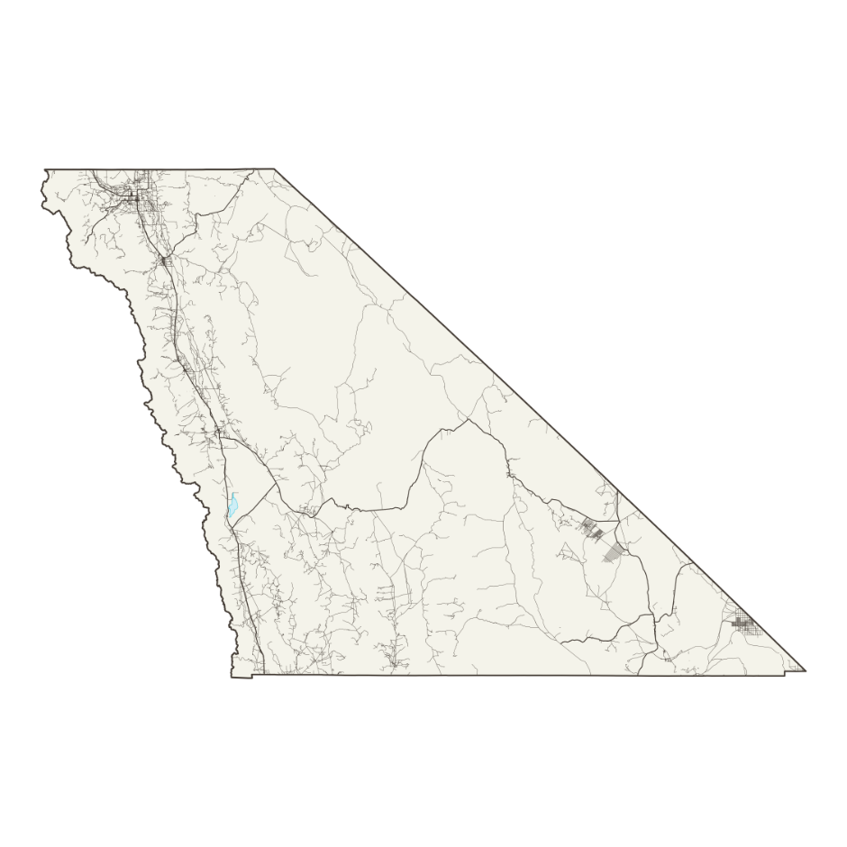

# Mapping United States

This repo contains a few helper methods to make working with the US Census shape files a
bit easier.

1. Caching layer to prevent make sure limit the amount of network activity.
2. Converts the layers over to Geopandas for you (where applicable) which makes graphing much easier.
3. A few helper functions for merging counties/states to create beautiful maps easily.

All of this should equate to an easier time making maps, and gives you more time for perfecting the design.

# Installing
`pip install mapping-united-states`

# Basic Usage

This will generate a county in Inyo County, California. The default settings should look decent on almost all
maps you generate, but we'll look at customizing everything in a moment.

```python
from mapping_united_states import mapping, CensusData

census_data = CensusData()


def map_county():
    # Mapping based on counties
    mapping.map_area(
        './Sub-California.png',
        [
            '06027' # You can provide the county FIPS, State FIPS, or the 2 letter state abbreviation
        ],
        mapping.MappingOptions(),
        census_data
    )


if __name__ == "__main__":
    map_county()
```

The code above will generate a file in the local directory called `Sub-California.png`. Assuming everything works as intended, you'll see an image similar to below.




# Customizing

Here's a simple example where we join a few counties in CA and NV together and change a few of the display settings.

```python
from mapping_united_states import CensusData, mapping
from mapping_united_states.mapping import MappingOptions

census_data = CensusData()

# Adjusting the mapping colors while mapping part of Nevada and Cali
options = MappingOptions()
options.border.line_color = '#FF0000'
options.border.fill_color = '#00FF00'
options.primary_roads.line_color = '#0000FF'
options.primary_roads.line_thickness = 10
options.secondary_roads.is_visible = False
options.neighborhood_roads.is_visible = False
# This defaults to 9,000,000 and represents how large the body of water needs to be before mapping
# Not having this option made some states feel a bit too busy for my liking... but Nevada it doesn't matter too much.
options.water.min_water_area = None 

mapping.map_area(
    'Sub-California-Nevada.png',
    [
        '06027',
        '06071',
        '32003',
        '32023',
        '32017',
        '32009'
    ],
    options,
    census_data
)
```

The code above will generate a file in the local directory called `Sub-California-Nevada.png`. Since we overrode a lot of 
functionality and colors, this one will look a bit like a crayon drawing, but you can use these simple settings to get more creative. 


# Technical Docs

## CensusData Class
The `CensusData` is just a simple wrapper using the `requests` library to retrieve the shapes file from the Census Bureau's FTP. The first time, 
it will download the files from the FTP, but afterwards it'll just use the cache to provide the files.

There's a few basic settings you can specify in the constructor to configure how the caching works and which year of census data it uses.

```text
CensusData(
    census_year: int = 2022, 
    cache_directory: Optional[str] = './caching/', 
    delay_between_requests_in_seconds: Optional[int] = 3
)

- census_year - This is based on the Census's FTP. The library was built off of 2022 (which is the default value), but 
    does work with other years (assuming the directory structure doesn't change).
    - https://www2.census.gov/geo/tiger/
    - Look for directories prefixed with `TIGER`, and those are the ones that this process is using for almost everything.
- cache_directory - This is where the files will be saved locally and will be used each time you build a map moving forward. DEFAULT is './caching/'
- delay_between_requests_in_seconds - For some of the map building, it's nesscary to hit the FTP with multiple requests in quick succession. This just prevents us from hitting the FTP too hard. Delay is in seconds and defaults to 3.
```


## Other Notes

Check out the `example_usage.py` for a few more simple examples.

Support us by checking out the [blog](https://www.pixelcodingstudio.com/mapping-with-census-data.html). We share additional tips to make the most of this library.